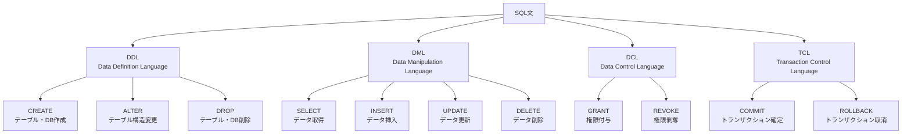

<!-- LP Toast: ランディングに戻る -->
<a href="./index.html" class="lp-toast">← LPに戻る</a>
<style>
.lp-toast{position:fixed;right:16px;bottom:16px;background:#111;color:#fff;padding:10px 14px;border-radius:8px;box-shadow:0 8px 24px rgba(0,0,0,.28);text-decoration:none;font-weight:600;z-index:9999;opacity:.95}
.lp-toast:hover{opacity:1;transform:translateY(-1px)}
</style>

# SQL チートシート
---
## SQLとは
> SQL（構造化照会言語）は、データベース内のデータを管理するための標準化されたデータベース言語です。データを格納、更新、削除、取得する操作を行うために使用され、INSERT、UPDATE、DELETE、SELECT といった命令文（SQL文）でデータベースに指示を出します。リレーショナルデータベース（RDB）で利用され、CREATE（テーブル作成）などの命令を組み合わせることで、データの検索やデータ構造の定義、さらにデータベースへのアクセス権限の管理も可能

[AWS SQL(構造化クエリ言語)とは何ですか？](https://aws.amazon.com/jp/what-is/sql)

## 基本SQLコマンド早見表

| 操作         | コマンド例                                                                 | 説明                         | 具体的な使用例 |
|--------------|----------------------------------------------------------------------------|------------------------------|----------------|
| データ取得   | `SELECT * FROM users;`                                                     | テーブル全件取得             | 社員テーブルから全社員の情報を取得<br/>`SELECT * FROM employees;` |
| 条件付き取得 | `SELECT name FROM users WHERE age > 20;`                                   | 条件指定で取得               | 20歳以上のユーザー名のみ取得<br/>`SELECT name, email FROM users WHERE age >= 20 AND status = 'active';` |
| 並び替え     | `SELECT * FROM users ORDER BY age DESC;`                                   | 並び順指定                   | 売上高の多い順に商品を表示<br/>`SELECT product_name, sales FROM products ORDER BY sales DESC LIMIT 10;` |
| データ挿入   | `INSERT INTO users (name, age) VALUES ('Taro', 25);`                       | 新規レコード追加             | 新しい顧客情報を登録<br/>`INSERT INTO customers (name, email, phone, created_at) VALUES ('田中太郎', 'tanaka@example.com', '090-1234-5678', NOW());` |
| データ更新   | `UPDATE users SET age = 26 WHERE name = 'Taro';`                           | 既存レコードの値を変更       | 商品価格を一括で10%値上げ<br/>`UPDATE products SET price = price * 1.1 WHERE category = 'electronics';` |
| データ削除   | `DELETE FROM users WHERE name = 'Taro';`                                   | レコード削除                 | 30日以上前の一時ファイルを削除<br/>`DELETE FROM temp_files WHERE created_at < DATE_SUB(NOW(), INTERVAL 30 DAY);` |
| テーブル作成 | `CREATE TABLE users (id INT, name TEXT, age INT);`                         | 新しいテーブル作成           | 注文履歴テーブルを作成<br/>`CREATE TABLE orders (id INT AUTO_INCREMENT PRIMARY KEY, user_id INT, product_id INT, quantity INT, order_date DATETIME, FOREIGN KEY (user_id) REFERENCES users(id));` |
| テーブル削除 | `DROP TABLE users;`                                                        | テーブル削除                 | 不要になったログテーブルを削除<br/>`DROP TABLE IF EXISTS old_access_logs;` |

---

### SQL基本構文のMermaid図



---

## よく使用するSQL関数

### 集計関数
| 関数名 | 例 | 説明 |
|--------|----|----|
| COUNT | `SELECT COUNT(*) FROM users;` | レコード数を取得 |
| SUM | `SELECT SUM(salary) FROM employees;` | 合計値を取得 |
| AVG | `SELECT AVG(age) FROM users;` | 平均値を取得 |
| MAX | `SELECT MAX(score) FROM tests;` | 最大値を取得 |
| MIN | `SELECT MIN(score) FROM tests;` | 最小値を取得 |

### 文字列関数
| 関数名 | 例 | 説明 |
|--------|----|----|
| UPPER | `SELECT UPPER(name) FROM users;` | 大文字に変換 |
| LOWER | `SELECT LOWER(name) FROM users;` | 小文字に変換 |
| LENGTH | `SELECT LENGTH(name) FROM users;` | 文字列の長さを取得 |
| SUBSTRING | `SELECT SUBSTRING(name, 1, 3) FROM users;` | 部分文字列を取得 |
| CONCAT | `SELECT CONCAT(first_name, ' ', last_name) FROM users;` | 文字列を結合 |

### 日付関数
| 関数名 | 例 | 説明 |
|--------|----|----|
| NOW | `SELECT NOW();` | 現在の日時を取得 |
| DATE | `SELECT DATE(created_at) FROM posts;` | 日付部分のみ取得 |
| YEAR | `SELECT YEAR(created_at) FROM posts;` | 年を取得 |
| MONTH | `SELECT MONTH(created_at) FROM posts;` | 月を取得 |
| DAY | `SELECT DAY(created_at) FROM posts;` | 日を取得 |

---

## JOINの種類

### INNER JOIN
```sql
SELECT users.name, orders.amount
FROM users
INNER JOIN orders ON users.id = orders.user_id;
```
両テーブルに一致するレコードのみ取得

### LEFT JOIN
```sql
SELECT users.name, orders.amount
FROM users
LEFT JOIN orders ON users.id = orders.user_id;
```
左テーブル（users）の全レコードと、右テーブル（orders）の一致するレコードを取得

### RIGHT JOIN
```sql
SELECT users.name, orders.amount
FROM users
RIGHT JOIN orders ON users.id = orders.user_id;
```
右テーブル（orders）の全レコードと、左テーブル（users）の一致するレコードを取得

### FULL OUTER JOIN
```sql
SELECT users.name, orders.amount
FROM users
FULL OUTER JOIN orders ON users.id = orders.user_id;
```
両テーブルの全レコードを取得

---

## 条件文とオペレータ

### WHERE句でよく使用する演算子
| 演算子 | 例 | 説明 |
|--------|----|----|
| = | `WHERE age = 25` | 等しい |
| <> または != | `WHERE age <> 25` | 等しくない |
| > | `WHERE age > 25` | より大きい |
| < | `WHERE age < 25` | より小さい |
| >= | `WHERE age >= 25` | 以上 |
| <= | `WHERE age <= 25` | 以下 |
| LIKE | `WHERE name LIKE 'T%'` | パターンマッチ |
| IN | `WHERE age IN (20, 25, 30)` | リスト内の値と一致 |
| BETWEEN | `WHERE age BETWEEN 20 AND 30` | 範囲内 |
| IS NULL | `WHERE email IS NULL` | NULLチェック |
| IS NOT NULL | `WHERE email IS NOT NULL` | NOT NULLチェック |

### 論理演算子
| 演算子 | 例 | 説明 |
|--------|----|----|
| AND | `WHERE age > 20 AND age < 30` | かつ |
| OR | `WHERE age < 20 OR age > 30` | または |
| NOT | `WHERE NOT age = 25` | ではない |

---

## GROUP BYとHAVING

### GROUP BY
```sql
SELECT department, COUNT(*) as employee_count
FROM employees
GROUP BY department;
```
指定した列でグループ化して集計

### HAVING
```sql
SELECT department, COUNT(*) as employee_count
FROM employees
GROUP BY department
HAVING COUNT(*) > 5;
```
GROUP BYの結果に対して条件を指定

---

## サブクエリ

### 単一値を返すサブクエリ
```sql
SELECT name
FROM users
WHERE age = (SELECT MAX(age) FROM users);
```

### 複数値を返すサブクエリ
```sql
SELECT name
FROM users
WHERE department_id IN (
    SELECT id FROM departments WHERE location = 'Tokyo'
);
```

### EXISTS
```sql
SELECT name
FROM users u
WHERE EXISTS (
    SELECT 1 FROM orders o WHERE o.user_id = u.id
);
```

---

## インデックス

### インデックス作成
```sql
CREATE INDEX idx_user_name ON users(name);
```

### インデックス削除
```sql
DROP INDEX idx_user_name;
```

---

## トランザクション

```sql
BEGIN;  -- トランザクション開始

UPDATE accounts SET balance = balance - 100 WHERE id = 1;
UPDATE accounts SET balance = balance + 100 WHERE id = 2;

COMMIT;  -- 変更を確定
-- または
ROLLBACK;  -- 変更を取り消し
```

---

## よく使用するデータ型

### 数値型
- `INT` - 整数
- `DECIMAL(p,s)` - 固定小数点数
- `FLOAT` - 浮動小数点数

### 文字列型
- `VARCHAR(n)` - 可変長文字列
- `CHAR(n)` - 固定長文字列
- `TEXT` - 長い文字列

### 日付・時刻型
- `DATE` - 日付（YYYY-MM-DD）
- `TIME` - 時刻（HH:MM:SS）
- `DATETIME` - 日付と時刻
- `TIMESTAMP` - タイムスタンプ

### その他
- `BOOLEAN` - 真偽値
- `BLOB` - バイナリデータ

---

## パフォーマンス最適化のヒント

1. **適切なインデックスの使用**
   - WHERE句でよく使用する列にインデックスを作成

2. **SELECT文の最適化**
   - 必要な列のみを指定（`SELECT *` を避ける）

3. **JOINの最適化**
   - 適切な結合条件の指定
   - 小さなテーブルから結合

4. **WHERE句の最適化**
   - 選択性の高い条件を先に記述

5. **LIMIT句の使用**
   - 大量データの取得時は件数制限を設定

---

## 実践的なSQLクエリ例

### ランキング取得
```sql
SELECT name, score,
       ROW_NUMBER() OVER (ORDER BY score DESC) as rank
FROM students;
```

### 重複データの削除
```sql
DELETE FROM users
WHERE id NOT IN (
    SELECT MIN(id)
    FROM users
    GROUP BY email
);
```

### 月別集計
```sql
SELECT 
    DATE_FORMAT(created_at, '%Y-%m') as month,
    COUNT(*) as order_count,
    SUM(amount) as total_amount
FROM orders
GROUP BY DATE_FORMAT(created_at, '%Y-%m')
ORDER BY month;
```

### 条件付きカウント
```sql
SELECT
    COUNT(CASE WHEN status = 'active' THEN 1 END) as active_users,
    COUNT(CASE WHEN status = 'inactive' THEN 1 END) as inactive_users
FROM users;
```

---

*このチートシートは基本的なSQL操作をカバーしています。データベース管理システム（MySQL、PostgreSQL、SQL Serverなど）によって構文が若干異なる場合があります。*
